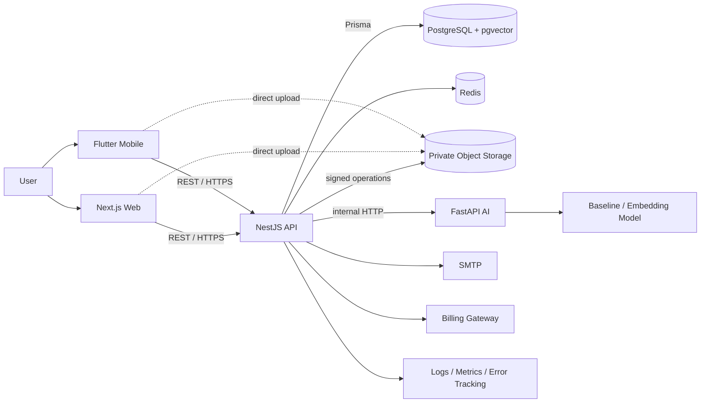
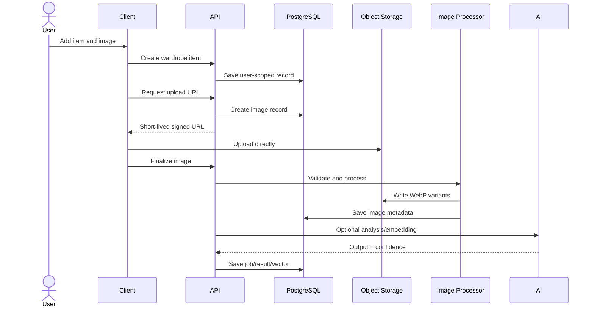
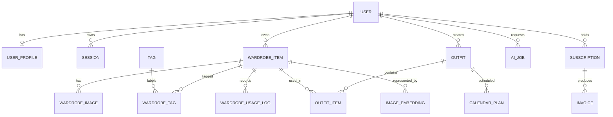

# Clorisa

> **A privacy-first, AI-assisted digital wardrobe, outfit planner, analytics platform, and smart shopping companion.**

Clorisa turns a physical wardrobe into a searchable and measurable digital system. Users can catalog clothes and accessories, build outfits from items they own, plan looks, record wear, understand wardrobe utility, and request context-aware styling or purchase advice.

This is a multi-client, service-oriented product—not only an AI or UI demo. It includes a Next.js product experience, Flutter client, NestJS API, FastAPI model service, PostgreSQL/pgvector, Redis, private image storage, billing abstractions, security controls, monitoring, CI, and operational tooling.

> **Maturity:** core web/API wardrobe workflows are implemented. Some production integrations require external credentials; native AI is currently a measured baseline; mobile is an early implementation; and virtual try-on is explicitly roadmap work. See [Implementation status](#implementation-status).

## Contents

- [Product](#product)
- [Features](#features)
- [Differentiation and novelty](#differentiation-and-novelty)
- [System architecture](#system-architecture)
- [How it works](#how-it-works)
- [Data and AI architecture](#data-and-ai-architecture)
- [Security, reliability, and scale](#security-reliability-and-scale)
- [Technology stack](#technology-stack)
- [Repository structure](#repository-structure)
- [API](#api)
- [Implementation status](#implementation-status)
- [Local development](#local-development)
- [Testing and deployment](#testing-and-deployment)
- [Portfolio and placement showcase](#portfolio-and-placement-showcase)
- [Roadmap and documentation](#roadmap-and-documentation)

## Product

### One-line pitch

Clorisa helps people wear more of what they own, create better outfits, and make informed shopping decisions using a private, structured wardrobe and explainable AI assistance.

### The problem

People forget items they own, repeat purchases, underuse clothes, struggle to coordinate complete looks, and rarely know wardrobe value or cost per wear. Generic styling AI also lacks a reliable boundary between owned products and imagined recommendations. Personal wardrobe and body images introduce additional privacy risks.

### The solution

Clorisa connects three questions normally spread across separate tools:

1. **What do I own?** A visual inventory with metadata, search, filters, and private images.
2. **What should I wear?** Outfit building, calendar planning, usage history, and wardrobe-aware recommendations.
3. **Should I buy this?** Similarity, duplicate-risk, compatibility, and wardrobe-gap reasoning.

### Intended users

- Students and professionals planning daily or weekly looks.
- Wedding shoppers coordinating clothing, jewelry, footwear, and accessories.
- Fashion-conscious users seeking better wardrobe utilization.
- Creators and stylists organizing repeatable looks.
- Future boutique, stylist, and brand partners.

### Expected product impact

| Problem | Capability | Outcome |
| --- | --- | --- |
| Forgotten items | Searchable visual wardrobe | Better visibility |
| Duplicate purchases | Embeddings and shopping checks | Lower duplicate risk |
| Outfit indecision | Owned-item-first styling | Faster decisions |
| Underused clothing | Wear logs and cost-per-wear data | Better utilization |
| Disconnected event planning | Outfit calendar | Fewer last-minute decisions |
| Sensitive imagery | Private storage and consent | Greater user control |

## Features

### Identity and account lifecycle

- Registration, login, logout, access/refresh sessions, email verification, and password reset paths.
- Browser cookie and mobile bearer-token flows.
- Persisted, hashed refresh tokens and session revocation.
- Redis-backed failed-login lockout with development fallback.
- User, admin, and super-admin roles.
- Account anonymization/deletion flow and audit record.

### Digital wardrobe

- Wardrobe item creation, update, archive, favorite, search, filtering, sorting, and pagination.
- Categories and custom tags.
- Color, secondary colors, size, material, pattern, fit, season, occasion, brand, price, currency, notes, and purchase URL.
- Multiple private images, primary-image selection, and deletion.
- Signed upload/read URLs for local or S3-compatible storage.
- Validation, re-encoding, metadata stripping, and WebP thumbnail/card/detail variants.
- Mark-worn events, last-worn time, and wear counters.

### Outfits, calendar, and analytics

- Persistent outfit creation with top, bottom, dress, outerwear, shoes, bag, accessory, and other slots.
- Outfit detail, editing, duplication, favorites, occasion, season, and visibility.
- Calendar plans with time, location, notes, lifecycle status, and basic conflict detection.
- Usage logs supporting wardrobe totals, value, most/least used items, stale items, and cost per wear.

### AI and shopping intelligence

- Clothing analysis and editable tagging suggestions.
- 768-dimensional embedding contract and pgvector-ready similarity.
- Outfit recommendations supplied with actual wardrobe context.
- Shopping checks with compatibility and duplicate-risk outputs.
- Native, OpenAI-compatible, Anthropic, Gemini, Azure OpenAI, Ollama, and custom provider types.
- AI jobs record provider, status, confidence, result, errors, and timing.
- Dataset normalization, split, embedding, baseline training, and evaluation scripts.
- Safe deterministic fallback when model inference is unavailable.

### Billing, administration, and operations

- Free, Pro, Stylist, and Enterprise subscription model.
- Entitlements for item count, storage, AI usage, and custom-provider access.
- Gateway-neutral billing, subscriptions, invoices, checkout, portal, and webhook paths.
- Admin users/roles, AI jobs, storage, health, reports, metrics, and audit logs.
- Health/liveness/readiness, Prometheus-style metrics, request IDs, structured logs, and optional error webhook.
- Backup, restore, retention, object-deletion, SMTP, storage, and billing verification scripts.

## Differentiation and novelty

Clorisa does not claim that wardrobe apps are globally unique. Its novelty lies in one coherent feedback loop:

```text
Catalog owned items → create outfits → schedule and wear them
        ↑                                      ↓
Improve purchase decisions ← measure utility and wardrobe gaps
```

Key differentiators:

- **Owned-item-first AI:** outside products cannot be represented as owned; shopping suggestions must remain separate.
- **Wardrobe intelligence:** items connect to outfits, calendar events, wear evidence, price, embeddings, and AI jobs—not just a photo gallery.
- **Pre-purchase reasoning:** candidate purchases can be compared with owned items and wardrobe gaps.
- **Privacy by architecture:** user scoping, private storage, expiring URLs, sanitized variants, consent, and deletion are technical controls.
- **Measured AI boundaries:** confidence, fallback state, editable outputs, and manual workflows prevent model failure from becoming product failure.
- **Vendor independence:** both AI and billing use provider abstractions.
- **Practical sustainability:** wear frequency, unused inventory, and cost per wear turn reuse into a measurable behavior.

## System architecture



Clorisa is a **modular monorepo with independently deployable services**. Transactional domains stay in one NestJS API where ownership rules and relational consistency matter. AI is separated because Python/model dependencies, scaling, latency, and failure modes differ. PostgreSQL is authoritative; Redis, model output, and object storage never replace ownership or business state.

| Component | Responsibility |
| --- | --- |
| Next.js web | Marketing, authenticated dashboard, browser API adapters, private-image proxy routes |
| Flutter | Device capture, secure token storage, wardrobe/outfit/AI/profile mobile flows |
| NestJS | Authentication, policy, validation, persistence, storage orchestration, entitlements |
| FastAPI | Analysis, embeddings, recommendation, shopping inference, model lifecycle |
| PostgreSQL | Users, sessions, wardrobe graph, jobs, billing, audit state |
| pgvector | Embedding storage and semantic retrieval |
| Redis | Distributed login protection and queue/cache foundation |
| Object storage | Durable original and processed image bytes |

## How it works

### Authentication

Passwords are hashed. Login creates short-lived access and longer-lived refresh credentials; only the refresh-token hash is persisted. Browsers use HttpOnly cookies plus CSRF validation for mutations, while mobile stores tokens in secure platform storage. Refresh rotation, logout, deletion, and previous-secret support provide revocation and controlled secret rotation.

### Private image upload



Direct upload avoids routing large files through the API. The API still owns authorization, storage keys, constraints, expiry, and finalization.

### Outfit and recommendation flows

The API verifies ownership of every item before persisting outfit-slot relationships. Calendar plans reference saved outfits. Mark-worn operations create usage evidence. For AI requests, entitlements are checked, a bounded wardrobe context is loaded, a provider-independent request is executed, and job/confidence/failure metadata is saved. A provider failure can fall back safely without blocking manual wardrobe use.

## Data and AI architecture



Design choices include UUID keys, case-insensitive unique emails, explicit ownership, lifecycle enums, indexed user/status/date queries, relational join tables, audit timestamps, controlled JSON extensibility, and `vector(768)` embeddings.

| AI module | Result | Current reality |
| --- | --- | --- |
| Clothing analysis | Category, colors, tags, confidence | Provider-aware plus baseline/fallback |
| Embedding | 768-dimensional vector | OpenCLIP-capable offline path; dev fallback |
| Similarity | Ranked owned items | Data/index/search path exists; needs real backfill/evaluation |
| Outfit stylist | Items and explanation | Working API/job path; native quality is baseline |
| Shopping check | Compatibility and duplicate risk | Working provider/native paths; ranking needs validation |
| Virtual try-on | Generated preview | **Not released**; endpoint returns unavailable |

AI must not invent owned items, should expose confidence/fallbacks, must allow correction, and cannot use personal photos for training without opt-in.

## Security, reliability, and scale

Implemented controls include bcrypt password hashing, hashed refresh sessions, CSRF protection, Helmet, CORS allowlists, rate limits, Redis login lockout, global validation/whitelisting, role checks, user-scoped queries, signed media URLs, configurable upload limits, request IDs, exception filtering, audit logs, and consent fields.

Health endpoints are `/api/v1/health`, `/health/live`, `/health/ready`, `/metrics`, plus AI `/health` on port `8000`.

Production hardening still includes full DTO coverage, Redis-backed global rate limiting, final CSP, encrypted stored provider credentials, complete external-data deletion workers, centralized telemetry, security testing, and least-privilege infrastructure.

The image worker is currently batch/command oriented. High-volume deployment should use BullMQ, SQS, or an equivalent durable queue with retries, idempotency, and dead-letter handling. Process-local metrics should be scraped/exported to a durable monitoring platform.

## Technology stack

| Layer | Technology |
| --- | --- |
| Web | Next.js 15, React 19, TypeScript, Tailwind CSS |
| Web data/state | TanStack Query, Zustand, Zod |
| Mobile | Flutter, Dart, Secure Storage, HTTP, Image Picker |
| API | NestJS 10, TypeScript, Prisma 6 |
| Data | PostgreSQL 16, pgvector, Redis 7 |
| AI | FastAPI, Python, optional OpenCLIP |
| Media | Sharp, local or S3-compatible/R2 storage |
| Integrations | SMTP/Nodemailer, gateway-neutral billing |
| Quality | Jest, Pytest, Playwright, Flutter Test |
| Delivery | Docker Compose, GitHub Actions |

## Repository structure

```text
Clorisa/
├── apps/mobile/               # Flutter Android/iOS client
├── apps/web-admin/            # Next.js public site and dashboard
├── services/api/              # NestJS API, Prisma, workers
├── services/ai/               # FastAPI and ML pipeline
├── packages/shared-types/     # Shared TypeScript contracts
├── packages/config/           # Shared configuration
├── infra/database/            # PostgreSQL extension initialization
├── infra/scripts/             # Operations and integration checks
├── docs/                      # Product, architecture, security, runbooks
├── docker-compose.yml
├── setup.sh
└── run.sh
```

## API

All application routes use `/api/v1`.

| Domain | Representative operations |
| --- | --- |
| Auth | register, login, refresh, logout, me, verify/reset, delete account |
| Profile | retrieve and update current profile |
| Wardrobe | CRUD, summary, favorite, archive, wear, image lifecycle |
| Taxonomy | category and tag CRUD |
| Outfits | list/detail/create/update/duplicate/favorite |
| Calendar | list, summary, plan outfit, mark worn |
| AI | settings, recommendations, shopping checks, analyze/embed/similar |
| Analytics | wardrobe metrics |
| Billing | plans, current, invoices, gateways, checkout, portal, webhooks |
| Admin | metrics, health, users, roles, jobs, storage, reports, audit logs |

See [API specification](docs/API_SPECIFICATION.md).

## Implementation status

| Area | Status | Notes |
| --- | --- | --- |
| Public/web product | **Implemented** | Marketing and authenticated dashboard routes exist |
| Auth | **Implemented / integration pending** | Core sessions work; production SMTP and broader E2E remain |
| Wardrobe | **Implemented** | Persistent CRUD, taxonomy, queries, favorite and wear flows |
| Image pipeline | **Implemented / verification pending** | Local/S3-compatible; real production bucket requires validation |
| Outfits | **Implemented** | Persistent slots, duplicate and favorite paths |
| Calendar | **Partial** | Persistence/basic conflicts; richer views remain |
| Analytics | **Partial** | Endpoint/UI exist; deeper definitions, tests, exports remain |
| Provider AI | **Partial** | Multiple paths; encrypted user keys and integration tests remain |
| Native AI | **Baseline** | Trainable scaffold, not production stylist quality |
| Similarity | **Partial** | Vector contract/schema/path exist; backfill and ranking eval remain |
| Billing | **Partial** | Entitlements/abstraction/UI exist; live gateway verification remains |
| Admin | **Partial** | Core RBAC/views; granular permissions remain |
| Flutter | **Early/partial** | Main flows started; device and release hardening remain |
| Virtual try-on | **Roadmap** | No generated preview is claimed |
| Operations | **Partial** | CI/scripts/health exist; managed deployment and drills remain |

See the maintained [feature status matrix](docs/FEATURE_STATUS_MATRIX.md).

## Local development

### Prerequisites

Node.js 22+, Python 3.12+, Docker Compose, and optionally Flutter/Ollama.

```bash
git clone <repository-url>
cd Clorisa
./setup.sh
```

The setup script creates missing environment files, installs dependencies, starts PostgreSQL/Redis when available, migrates/seeds, trains/evaluates the baseline, and runs verification.

Start infrastructure, then the applications:

```bash
./run.sh infra
# in another terminal
./run.sh all
```

| Service | URL |
| --- | --- |
| Web | `http://localhost:3000` |
| API | `http://localhost:3001/api/v1` |
| AI | `http://localhost:8000` |

Individual modes are `./run.sh web`, `api`, or `ai`; `./run.sh stop` stops development ports.

Important environment groups are database/Redis, JWT secrets, CORS/rate limits, AI providers, storage/bucket credentials, SMTP, billing gateways, and monitoring. Start from [.env.example](.env.example); never deploy example secrets.

## Testing and deployment

```bash
npm run lint
npm run typecheck
npm run test:api
npm run build
npm --workspace apps/web-admin run test:e2e
PYTHONPATH=services/ai python3 -m pytest services/ai/tests
(cd apps/mobile && flutter test)
```

CI starts PostgreSQL/pgvector and Redis, deploys migrations, seeds, lints, type-checks, tests, and builds Node applications. A separate AI job trains/evaluates the baseline and runs Pytest.

Production should use separately scalable web/API/AI containers, managed PostgreSQL and Redis, private object storage, TLS, secret management, a durable worker, centralized telemetry, gated migrations, automated backups, and tested restoration. Before release, verify SMTP, object storage, billing, authentication, upload/deletion, AI fallback, health checks, backup/restore, and JWT rotation.

## Portfolio and placement showcase

Clorisa demonstrates product thinking and engineering across frontend, mobile, API design, relational modeling, AI integration, privacy, subscriptions, observability, and DevOps.

Strong interview discussion points:

- Why transactional domains share a modular API while AI is independently deployed.
- Why image bytes belong in object storage and metadata in PostgreSQL.
- How signed direct uploads reduce API load without weakening authorization.
- Why pgvector is appropriate before introducing a separate vector database.
- How hashed rotating sessions enable revocation.
- How provider abstractions reduce AI/payment lock-in.
- Why confidence, fallbacks, and manual workflows are essential product behavior.
- Where the batch worker stops scaling and how to introduce queues and idempotency.

**Resume-ready summary:**

> Designed and built Clorisa, a full-stack AI-assisted wardrobe platform using Next.js, Flutter, NestJS, FastAPI, PostgreSQL/pgvector, Redis, Prisma, and S3-compatible storage. Implemented secure sessions, user-scoped wardrobe/outfit workflows, signed image uploads and processing, vector-ready similarity, provider-agnostic AI and billing, entitlement enforcement, observability, CI, and operational runbooks.

Suggested demo: register/login; upload an item; explain signed storage; search and mark worn; create/plan an outfit; inspect analytics; run an AI/shopping request and show confidence/fallback; then present the schema, monitoring, CI, and honest status table.

## Roadmap and documentation

Near-term priorities are broader DTO/E2E coverage, staging verification, durable image jobs, real embedding backfill/ranking evaluation, analytics reconciliation, and mobile completion. Medium-term work includes encrypted provider secrets, AI feedback/evaluation, reminders, granular permissions, centralized monitoring, and complete external deletion. Virtual try-on remains long-term until consent, safety, deletion, and quality requirements are proven.

| Document | Purpose |
| --- | --- |
| [System architecture](docs/SYSTEM_ARCHITECTURE.md) | Components and runtime |
| [Product requirements](docs/PRODUCT_REQUIREMENTS.md) | Users, use cases, plans, metrics |
| [Feature status](docs/FEATURE_STATUS_MATRIX.md) | Detailed implementation truth |
| [Database schema](docs/DATABASE_SCHEMA.md) | Data model |
| [AI modules](docs/AI_MODULES.md) | AI contracts and guardrails |
| [Security and privacy](docs/SECURITY_PRIVACY.md) | Protection and consent |
| [Deployment guide](docs/DEPLOYMENT_GUIDE.md) | Environments and release |
| [Auth runbook](docs/AUTH_SECURITY_RUNBOOK.md) | Authentication operations |
| [Database runbook](docs/DATABASE_OPERATIONS_RUNBOOK.md) | Migration/backup/restore |
| [Testing plan](docs/TESTING_PLAN.md) | Quality strategy |
| [Roadmap](docs/ROADMAP.md) | Delivery sequence |

## Contribution principles

- No dead buttons, fake success, or unlabeled mock behavior.
- Every visible action works or stays feature-flagged.
- All user data is ownership-scoped; images are private by default.
- Manual workflows survive AI failure.
- Roadmap features are labeled honestly.
- Changes include appropriate tests and documentation.
- Secrets and unlicensed training data are never committed.

## License

No open-source license is currently declared. Unless the owner adds one, treat this source as **all rights reserved**.

<p align="center"><strong>Clorisa — know your wardrobe, style what you own, and shop with context.</strong></p>
